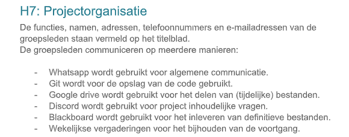
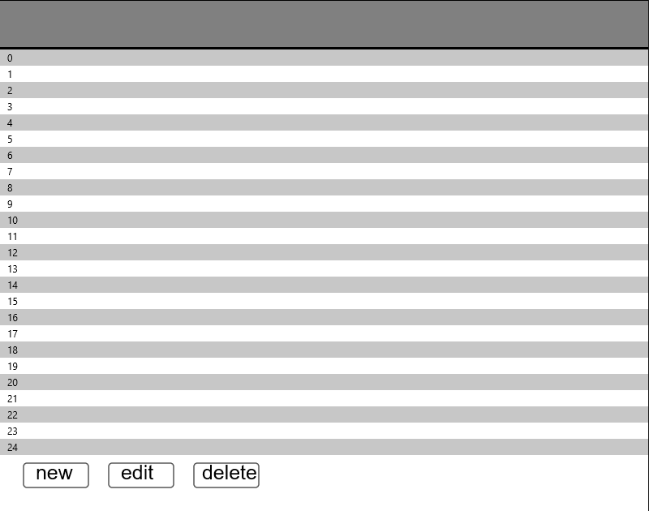
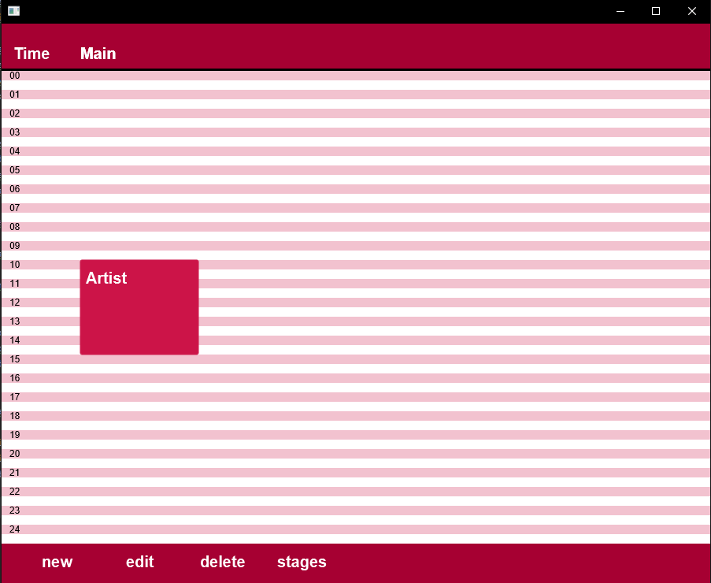

# Portfolio
## Remco Meijer
## 2155240
## Jaar 1, periode 3, klas B

# Weekelijkse reflectie
## Week 1
Deze week zijn wij begonnen met het plan van aanpak. Hierbij begon het met Dogukan die de taak met overleg had verdeeld. Hierdoor had iedereen zijn eigen hoofdstuk waar hij aan kon gaan werken. Zelf heb ik aan de projectorganisatie 
gewerkt. Hier staat in hoe wij als groep comminuceren en welke rollen elk persoon heeft. Verder hebben wij nog een design gemaakt voor de GUI, die wij de komende weken gaan maken. Verder is er niet veel gebeurd in week 1.


## Week 2
In week twee zijn wij begonnen met het ontwerp van onze agenda module. Hierbij hebben wij een klassediagram gemaakt, de functionaliteit bedacht en een ontwerp van de module. Deze week werden de opdrachten opgedeeld. 
Samen met Kim kreeg ik de opdracht om de agenda GUI te maken. We begonnen eerst puur met JavaFX, zonder iets te tekenen, maar we kwamen er snel achter dat het niet zou werken zo, dus zijn wij verder gegaan op 2D, wat redelijk werkte.
We hebben toen een simpele tabel gemaakt met tijden en stages, met een popup dat redelijk werkte. De volgende dag hebben wij de agenda opgeschoond en de layout verbeterd. 
Ik ben redelijk tevreden over de resultaten van deze week.


## Week 3
Deze week ben ik verder gegaan met de opmaak van de agenda en heb ik het hele.. mooie kleuren gegeven en zijn de shows toegevoegd aan de GUI. Florian heeft die week opjectIO toegevoegd, waardoor het mogelijk is om shows op te slaan of te bewerken in de agenda. 
Kim heeft dit vooral werkend gekregen in de GUI en ik heb deze week meer megekeken.
Ik vind het jammer dat ik deze week minder gedaan heb, behalve de layout van de agenda. Gelukkig is de agenda goed bijgewerkt.
## Week 4
Deze week was de opdracht moeilijk op te verdelen en heb ik vooral JSON proberen te snappen. Helaas mochten wij niet meer aan de agenda GUI werken, 
anders had ik daar verbeteringen kunnen maken. Gelukkig kregen we hier een geel/oranje stoplicht voor. Dit betekend dat de GUI niet perfect was, maar oke functioneerde. 
Zelf heb ik deze week minder gedaan voor het project, aangezien er niet meer taken waren om te verdelen. 
## Week 5
Deze week focusten wij vooral op de opzet van de festivalsimulatie. 
We hebben met zijn alle op het whiteboard de ideeën uitgewerkt en de taken verdeeld. Deze week moest ik samen met Florian de NPC classe maken. Dit heeft florian voor het grootste deel gedaan. Florian heeft daarna de bugs eruit gehaald,
en het werkrend gekregen. Omdat ik verder niet veel te doen had, heb ik me verdiept met de A-Star pathfinding. Dit bleek uiteindelijk geen oplossing te zijn en werd er voorgesteld om dijkstra's algoritme te gebruiken. Ook hier heb 
## Week 6
Heb verder gewerkt aan de Agenda module, aangezien er cruciale dingen nog toegevoegd moesten worden. In het begin van week 4 kregen wij een oranje stoplicht omdat de stages nog niet veranderd konden worden. Ik wilde dat nu toevoegen,
aangezien dat uiteindelijk er toch in moest komen. Aan het einde van de week heb ik het adden van stages werkend kunnen krijgen, dus nu kunnen er stages toegevoegd worden en opgeslagen worden. Helaas werkt dit nog niet zo vloeiend
als ik hoopte, aangezien er nog veel foutmeldingen te zien zijn, en het programma soms niet doet wat het moet doen. 
## Week 7
Deze week hebben wij gefocust op verbeteringen. Ik heb samen met Florian de agenda GUI verbeterd, door het robuuster te maken. Het meeste aandacht is aan de user inputs besteed, door de inputs te beperken en errors toe te voegen.
Ik dacht dat wij er redelijk vlot klaar mee zouden zijn, maar helaas hebben wij dat deze week niet kunnen afronden. Verder heb ik voor de agenda GUI wat bugs eruit gehaad en de functionaiteit over het algemeen verbeterd.
Ten slotte hebben we veel onnodige en duplicate code weggehaad of verbeterd en op vraag van Dogukan overal comments verbeterd en toegevoegd. Ik probeer meestal tijdens het schrijven van code kleine regels commentaar toe te voegen,
dus gelukkig hoefde ik niet al te veel extra werk te doen. Het project gaat oke, de rest van de groep is zich aan het focussen op de simulatie, wat flink vooruitgang maakt.  

## Week 8
Doordat we nu thuis werkten houden we via discord contact met elkaar. Ik kon deze week weer verder werken aan de GUI, aangezien deze nog steeds hele leuke foutmeldingen gaf. Het is me gelukt om de meeste bugs eruit te halen, maar
telkens als je denkt dat je klaar bent, kom je weer nieuwe tegen. Het viel me op dat het lastig is om overzicht te houden van wat er al toegevoegd is en wat nog niet. Ik probeer nu fouten eruit te halen, door verschillende dingen in de GUI
te zetten, en te kijken wat de GUI er mee doet. Als ik ergens niet tevreden over ben, dan pas ik dat aan. Verder heb ik tijdens de vergaderingen meegekeken en meegedacht over de pathfinding en de simulatie. Uiteindelijk is het gelukt
om de nps's rond te laten lopen en is de simulatie over het algemeen compleet.


# Vakinhoudelijke reflectie
## week 2
We begonnen met het maken van de GUI. Hier hadden we de keuze om met java2d of javaFX te werken. Aangezien we al een beetje ervaring in javaFX hadden, begonnen wij daarmee de GUI te maken. 
Al snel kwamen wij er achter dat java2D de betere optie is en hebben wij de GUI er naar omgezet. Daarna heb ik knoppen toegevoegd die een popup tonen, die kim heeft gemaakt. De popups werken wel in javaFX, omdat
dit vooral tekstvakken en knoppen zijn, waar javaFX prima voor te gebruiken is.

## Week 3
Deze week heeft Florian ObjectIO toegevoegd om de shows op te kunnen slaan. Het is Florian uiteindelijk gelukt om het toe te voegen en heeft laten zien hoe het werkt en hoe we er om mee kunnen gaan. Deze week heb ik vooral 
gekeken naar hoe ik Objecten uit een file kan halen en dat dan kan laten tekenen in de GUI. Hiervoor heb ik de serializer gebruikt, die een arraylist in de dataStore opslaat, bij opstart van de GUI. Uiteindelijk kan je 
dan uit de datastore de arraylist halen met de juiste objecten en ze op de correcte positie laten tekenen in de GUI. 

## Week 7
Deze week heb ik vooral op het debuggen gefocussed. Ik ben nog niet vlug met toevoegen van foutmeldingen, dus heb hier veel tijd aan besteed. Het debuggen bestaat vooral uit veel if statements en foreach loops die de database
doorgaan en kijken of alle criteria voldoen. 
```
if (!this.stageField.getText().isEmpty()) {
                  spacingSize(9);
                  agenda.data.Stage newStage = new agenda.data.Stage();
                  newStage.setName(this.stageField.getText());
                  this.newShow.setStage(newStage);
                  agenda.data.Stage showStage = new agenda.data.Stage();
                  showStage.setName(this.stageField.getText());
                  //looks at the data store, if it is empty, there is no stage to compare
                  if(!DataStore.getStages().isEmpty()) {
                      System.out.println(DataStore.getStages());
                      //Goes trough all stages and tries to find an equal stage
                      for(agenda.data.Stage stage : DataStore.getStages()) {
                          //if found, stage found = true
                          if(stage.getName().equalsIgnoreCase(this.stageField.getText())) {
                              stageFound = true;
                          }
                      }
                      //if stage is not found, it just adds the stage to the file
                      if (!stageFound){
                          showStageList.add(showStage);
                      }
                  //data store is empty, so it just adds the stage to the file
                  } else {
                      showStageList = DataStore.getStages();
                      showStageList.add(showStage);
                  }
         }
````

Een voorbeeld van 1 van de if statements dat de inputs valideert. 

## Week 9
Deze week kreeg ik een vage error van een ClassCastException. Dit kon helemaal niet in regel waar dit gebeurd is, aangezien ze hier een Show met een Show vergelijkten. Na het zoeken in de code kon ik geen conclusie trekken 
uit deze foutmelding. Toen ik het op het internet opzocht, kreeg ik te zien dat dit kon gebeuren als twee objecten door een andere ClassLoader worden aangemaakt. Ik heb geen ervaring met ClassLoaders, dus heb ik dit
helaas niet kunnen oplossen. De error gebeurt onregelmatig en is nog niet opgelost. Ik ben ook de enigste die dit bij het runnen van de code tegenkomt.