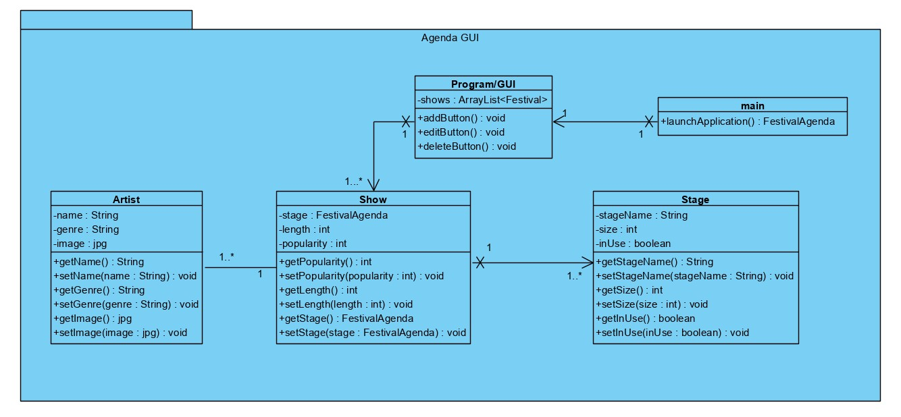
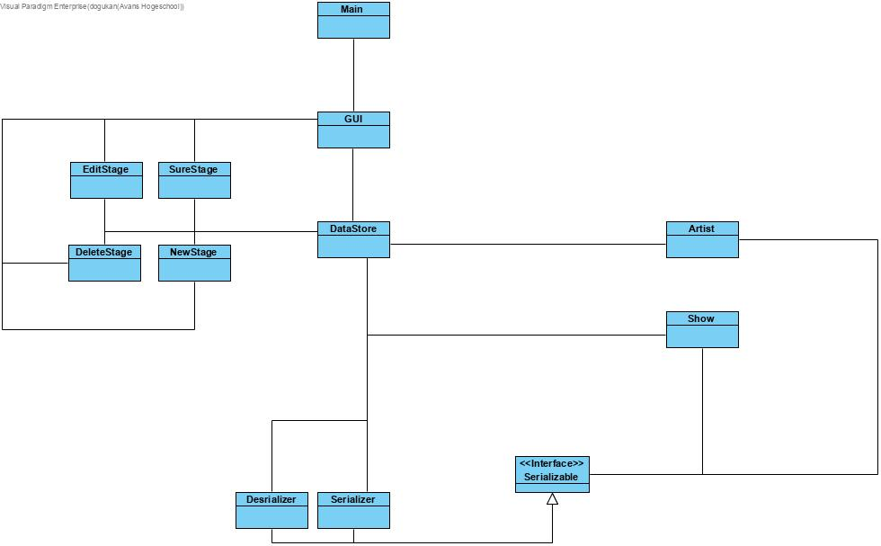
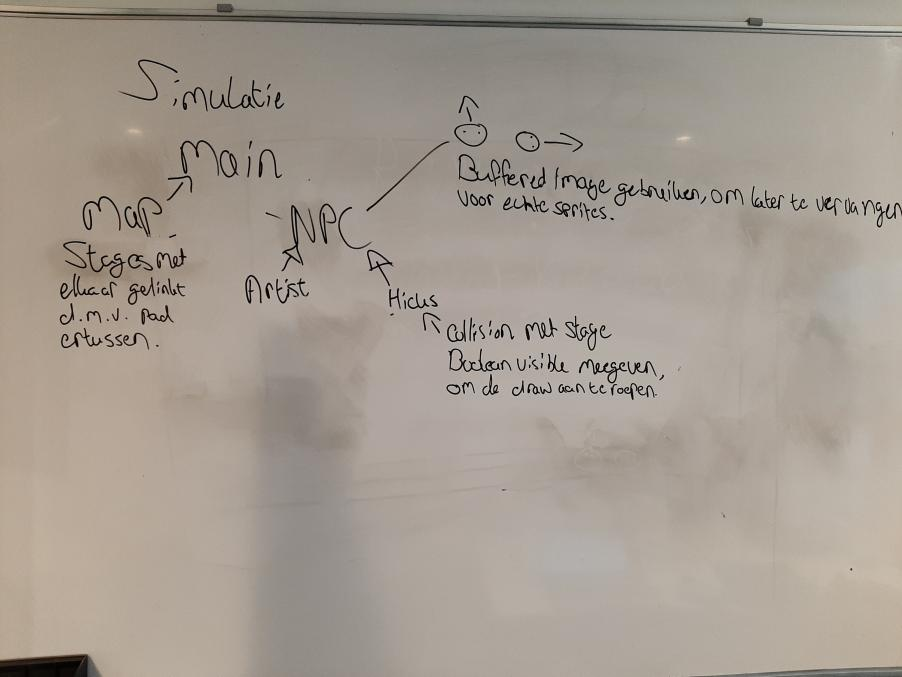

# Festival Planner
## Dogukan Akyazi 
## Student nummer: 2158676
## Klas: B5
***
## Week 2
Week 2 begon met het implementeren van code.
We hadden in week 1 een ontwerp en datastructuur voor de agenda module bedacht, en het is nu in deze week de taak om dit te realiseren.
De opzet voor de datastructuur ziet er zo uit:

We hebben een GUI klasse en een DataStore klasse, deze twee moeten op het einde met elkaar communiceren zodat de data die binnenkomt ook meteen afgebeeld kan worden.
De GUI klasse heeft een paar andere klasse die als knoppen werken. Aan de hand van welke knop wordt gedrukt, is er een klasse die ervoor zorgt dat de ingevulde data in de DataStore wordt gezet.
Naast de knoppen hebben we data klasse zoals:
- Show
- Artist 
- Stage

<br/>Deze klasse zijn de componenten die nodig zijn om bepaalde data op te slaan. De Show klasse slaat een begin- en eindtijd op plus welke stage het moet zijn en hoe populair deze show zal zijn.
De Artist klasse slaat een persoon op die een Show heeft op een bepaald tijdstip. De Stage klasse geeft alleen aan welke stage het is.
Naast het datastructuur hebben we ook een ontwerp voor de GUI gemaakt en die ziet er als volgt uit:

We hebben met z'n allen besloten om een stroken planner te gebruiken. We hebben hiervoor gekozen omdat we voor een simplistische design gingen.
Als we iets willen toevoegen dan moet er een pop-up komen om de data erin te stoppen, en als we iets willen deleten moet er een pop-up komen. 
Nadat je iets wilt deleten dan moet er nog een pop-up tevoorschijn komen om zeker te weten dat je deze item wilt verwijderen.
Het realiseren ervan gebeurd in deze week.

Situatie: Hoe moet data opgeslagen worden?<br/> Ik pakte de situatie als volgt aan: Ik keek eerst of er veel klassen waren die deze data nodig hadden, daarna werd er gekeken naar de opslag methode.
Ik kijk eerst naar arrayList van objecten, maar vond het eigenlijk nog niks (het zag er alleen uit als een laatste optie).
Wat ik eigenlijk wil hebben was een hashmap die ik makkelijk kon bereiken vanwege de key-value structuur die de hashmap bevat.
Ik heb het verwerkt in de show klasse en het werkte als volgt: 
```` java 
public HashMap<String, Artist> getArtistH() {
        return artistH;
    }

    public void setArtistH(HashMap<String, Artist> artistH) {
        this.artistH = artistH;
    }

    public void addArtists(Artist artist){
        String name = artist.getName().toLowerCase();
        if(!this.artistH.containsKey(name) && name.equalsIgnoreCase(artist.getName())){
            this.artistH.put(name, artist);
        }
    }
````
Hoe het werkt is: Er wordt een lege hashmap gemaakt om de data erin te stoppen, daarna word er op basis van de ingevulde artiest naam gekeken (het heeft ook geen hoofdlettergevoeligheid).
Deze manier werkte, maar is later weer terug gegaan naar een arraylist die de data van een artiest opslaat. Het ophalen van de data uit de hashmap ging niet zo soepel als verwacht, waardoor het is omgegooid naar een arraylist.
***
## Week 3
In week 3 werd er besproken wat er nog gedaan moest worden. Uiteindelijk hebben we een ander datastructruur gebruikt zodat elke klasse die data bevat opgeslagen kan worden in een centrale plek.
Deze centrale plek kon dan ook weer data doorgeven aan de klassen die het nodig hadden.
De revamped versie van de agenda module ziet er als volgt uit:

De besloten manier van de GUI is als volgt: De GUI heeft knoppen nodig die specifieke instructies afhandelen, zoals een artist toevoegen of verwijderen.
 Elke knop is een klasse, deze klasse handeld aan de hand van z'n functie het af.


Situatie: Koppelen van de database met de gui werkt niet
<br/>Wat we hebben gedaan is het maken van de datastore en gui apart gehouden, dit was vooral zodat andere mensen ook iets te doen hadden. Deze twee packages werkte allebei, maar niet in unison. Hoe dit opgelost is, is als volgt:
Alle methodes in de datastore statics maken, daardoor is alles van de datastore overal bereikbaar. Hierdoor kan de gui in unison werken met de datastore.
Ik wil later de datastore veranderen in een singleton zodat de data makkelijker te bereiken is, en zonder risico van de static functies kan het programma nog soepeler lopen.
Het opslaan van de data wordt gedaan d.m.v. object I/O, zodat de datastore dat later kan ophalen vanwege de deserializer. 
****
## Week 4
In week 4 hebben we wat meer informatie gekregen over hoe we een map kunnen maken en inladen.
We hebben ervoor gekozen om twee personen dit te laten doen, zodat er goed wordt overlegd over de map opbouw.
De eindversie van de map ziet er als volgt uit: 
  
Week 4 had de volgende situatie: Het opknappen van de PVA, en de gemaakte map inladen.
Ik heb deze taken onderverdeeld in: 
PVA: De hoofdstukken waar kritiek bijstond moest degene die dat stuk had geschreven opknappen. De uiteindelijke mensen die dat moesten doen waren: 
Kim, Timo, Natalie en ik (Dogukan).
Ik was voornamelijk bezig met het herschrijven van de projectactiviteiten, wat er verbeterd moest worden was: 
- De projectactiviteiten verduidelijken
- Het beter opdelen d.m.v. fasen
<br/>
Het inladen van de map d.m.v. json was onderverdeeld tussen: Timo en Natalie.
Het inladen van de map is een succes. We moeten nu nog wachten op de characters afbeelden in de map, en de pathfinding voor het laten lopen van de characters.

****
## Week 5
In week 5 was het de doel om een persoon (NPC) op de gemaakte JSON map te laten lopen. 
We hebben dit zo opgedeeld:

We houden de simulatie en agenda modules van elkaar af voor nu, want we willen eerst alles klaar hebben staan om later samen te voegen.
De NPC klasse moet een plaatje hebben voor de persoon, het moet een begin- en eindpunt hebben en het moet collision hebben zodat ze niet in elkaar gaan lopen.
De NPC klasse is een super klasse waarvan de Artist en Visitor (Hicks) de subklassen zijn. Doordat we dan die subklassen gebruiken kunnen we gemakkelijker een verschil zien per ingeladen persoon.

Situatie: Duidelijk maken hoe de NPC moet werken.
Ik heb met mijn groep ideeën bedacht voor de codestructuur voor de klassen. We hebben bijvoorbeeld gezegd dat een Artist altijd er anders uitziet t.o.v. een Visitor. We hadden ook een idee om animaties te hebben voor de sprites d.m.v. een bufferedImage array.
Dit kwam uiteindelijk niet van pas, omdat het uitvogelen van de NPC klasse wat langer duurde dan gehoopt. 
Wat ik uiteindelijk beter kon doen was vooral meer werk opdelen zodat iedereen iets te doen had, 
maar dit was niet gelukt dus hoop ik dat het volgende week beter kan.

****
## Week 6
Deze week moesten we (Kim en ik) beginnen aan de pathfinding van het project. 
De opties die we hadden waren:
- Zelf uitzoeken, d.m.v. informatieve bronnen.
- Een ander projectgroep vragen
- Een leerkracht vragen
<br/>

Waar wij voor hebben gekozen is de eerste optie. 
Waar wij op hoopten was dat we dan een beter begrip hadden over het onderwerp.
Doordat we dan een beter begrip hadden konden we het makkelijker implementeren in andere projecten, en het zelf uitzoeken ervan is ook een belangrijk leerproces.
De eerste paar dagen van week 6 hebben we veel informatieve bronnen opgezocht, zodat het implementeren misschien makkelijker kon zijn.
Na deze paar dagen hebben we geprobeerd om een stuk code te schrijven, deze code had het dijkstra algoritme in gedachten.
We hebben twee dagen daaraan gezeten om het stuk code werkend te krijgen. Dit is dus uiteindelijk niet gelukt, en zijn we weer vanaf het begin begonnen.
We hebben gezocht naar het greedy algoritme en het breadth first search algoritme. We hebben uiteindelijk aan het eind van deze week besloten om breadth first search te gebruiken.
Wat we beter konden doen deze week was sneller hulp vragen van andere groepen, en leerkrachten. Doordat we dat te laat hebben gedaan begonnen we achterstand te krijgen op het project.
Wat we wel hebben gemaakt is een methode die de collisie laag van onze json file kon uitlezen.
```` java 
  public void createNode(FXGraphics2D graphics, int[][] map) {
          int posX = 0;
          int posY = 0;
          for (int y = 0; y < height; y++) {
              for (int x = 0; x < width; x++) {
                  posX += 32;
                  int gid = map[y][x];
                  if(gid == 0){
                      graphics.setColor(Color.GREEN);
                      graphics.draw(new Rectangle2D.Double(posX, posY, 32,32));
                  } else if(gid == 975){
                      graphics.setColor(Color.RED);
                      graphics.draw(new Rectangle2D.Double(posX, posY, 32,32));
                  }
              }
              posY += 32;
          }
      }

````
Hoe deze stuk code werkt is als volgt: We vragen de collision layer van de map klasse op door middel van:
```` java
this.map.getTilelayers().get(3).getLayer();
````
De map klasse heeft dus een ArrayList van alle tile lagen, hierdoor kunnen we gemakkelijk de tile map meegeven als een van de parameters.
Nadat we de collision layer hebben, tekenen we aan de hand van welke gid de huidige tile heeft een groen (voor geen collision) of een rood (wanneer er collision is) blokje.
We hadden nog steeds geen idee hoe we het algoritme moesten implementeren in code, dus hebben we Sjoerd gevraagd. 
Het werdt ons langzamerhand steeds duidelijker hoe het algortime werkte en hebben we besloten om in week 7 dit af te maken.

****
## Week 7
Deze week hadden we weer te maken met het pathfinding algoritme. Onze opties waren nog steeds hetzelfde als in week 6.
We hebben deze keer om hulp gevraagd. We kozen hiervoor omdat we geen tijd meer konden wegzetten voor het pathfinding algoritme.
Nadat we hulp hadden gekregen, was de rest van de code schrijven makkelijker. We hebben uiteindelijk de breadth first search algoritme uitgewerkt en het kwam er zo uit te zien:
```` java
public void BFS(Point2D pos, String route) {
        this.grid = getTileMap();
        if (inGrid(pos.getX(), pos.getY())) {
            this.queue = new LinkedList<Tile>();
            grid[(int) pos.getY()][(int) pos.getX()].setDestination(true);
            grid[(int) pos.getY()][(int) pos.getX()].addRoute(route, new Point2D.Double(0, 0));
            grid[(int) pos.getY()][(int) pos.getX()].setVisited(true);

            checkNeighbour(pos, route);

            while (!this.queue.isEmpty()) {
                final Tile checkTile = queue.poll();
                checkNeighbour(checkTile.getGridPos(), route);
            }
            grid[(int) pos.getY()][(int) pos.getX()].setDestination(false);

            for (int y = 0; y < height; y++) {
                for (int x = 0; x < width; x++) {
                    grid[y][x].setVisited(false);
                }
            }
        }
    }
````
Dit algoritme had ook hulp methodes zoals:
```` java
public void checkNeighbour(Point2D pos, String route) {

        if (inGrid(pos.getX(), pos.getY() + 1)) {
            final Tile checkTile = this.grid[(int) pos.getY() + 1][(int) pos.getX()];
            if (!checkTile.isWall() && !checkTile.isVisited() && !checkTile.isDestination()) {
                checkTile.addRoute(route, new Point2D.Double(0, -1));
                checkTile.setVisited(true);
                queue.add(checkTile);
            }
        }

        if (inGrid(pos.getX(), pos.getY() - 1)) {
            final Tile checkTile = this.grid[(int) pos.getY() - 1][(int) pos.getX()];
            if (!checkTile.isWall() && !checkTile.isVisited() && !checkTile.isDestination()) {
                checkTile.addRoute(route, new Point2D.Double(0, 1));
                checkTile.setVisited(true);
                queue.add(checkTile);
            }
        }

        if (inGrid(pos.getX() + 1, pos.getY())) {
            final Tile checkTile = this.grid[(int) pos.getY()][(int) pos.getX() + 1];
            if (!checkTile.isWall() && !checkTile.isVisited() && !checkTile.isDestination()) {
                checkTile.addRoute(route, new Point2D.Double(-1, 0));
                checkTile.setVisited(true);
                queue.add(checkTile);
            }
        }

        if (inGrid(pos.getX() - 1, pos.getY())) {
            final Tile checkTile = this.grid[(int) pos.getY()][(int) pos.getX() - 1];
            if (!checkTile.isWall() && !checkTile.isVisited() && !checkTile.isDestination()) {
                checkTile.addRoute(route, new Point2D.Double(1, 0));
                checkTile.setVisited(true);
                queue.add(checkTile);
            }
        }
    }
````
en
```` java   
    private boolean inGrid(double x, double y) {
            return x < width && x > -1 && y < height && y > -1;
        }
````
Het algoritme werkt in onze code als volgt:
Je hebt een begin positie wat eigenlijk je eind punt is. Hij heeft dit punt nodig zodat het algoritme de omliggenden kan checken. 
Nadat je een beginpositie hebt moet de collision layer oftewel de grid vanaf die positie zijn omliggenden checken.
Dit gebeurd door middel van de checkNeighbour methode, deze methode heeft een hulper methode die inGrid heet. De inGrid methode checkt of de huidige positie buiten het grid valt of niet.
Als de huidige positie binnen het grid valt dan checkt deze positie zijn omliggenden. Nadat dit voltooid is op elke tile die hij kan bekijken vanaf de huidige positie wordt deze toegevoegd aan een queue en wordt de hasBeenChecked boolean op true gezet.
Dit hebben we gedaan zodat de tile niet op de volgende positie bekeken wordt. Elke bekeken tile krijgt een pijl die uiteindelijk naar het eindpunt wijst. 
Nadat dit algoritme door elke tile op de grid is geweest, dan wordt er een route gemaakt met alle pijlen en een route naam. Wanneer de route is gemaakt, wordt elke tile op de grid weer op false gezet zodat de booleans weer opnieuw kunnen checken of iets een eindpunt is, of dat het een al bezochte is.
Dit hebben we nagelopen d.m.v. de pijlen uitprinten op de map met een opgeslagen route. 
Er zijn niet echt verbeter punten in deze week gevallen.

****
## Week 8
Deze week heeft de groep een situatie waar alle geschreven code nu bijelkaar gebracht moest worden.
- Elke dag eraan zitten 
- Het opdelen van aan elkaar koppelen

<br/>
We hebben gekozen om er elke dag aan te werken met z'n allen, zodat iedereen begreep wat de aan elkaar gekoppelde code deed.
Hoe we het aangepakt hebben is door middel van discord streaming, zodat iedereen ook kon meekijken met wat er gedaan wordt en eventuele ideeen verwerkt worden.
De eerste paar dagen was het koppelen van de NPC's met de map, 
we hebben het makkelijk aan elkaar kunnen koppelen doordat we de NPC klasse hadden klaargemaakt voor het eventueel koppelen ervan. 
Daarna was het ophalen van data uit de Datastore nodig zodat er specifieke routes klaar stonden voor de podia.
Wat ik zelf beter kon doen was het opdelen van wat er gedaan moest worden, zodat iedereen iets te doen had. Dit zal ik zeker meenemen voor het volgende project.

****
## Week 9
In week negen hebben we het volgende gedaan: We hebben gekeken naar de laatste dingen die nog moeten gebeuren, en het opgedeeld aan de hand van wat er nog moest gebeuren.
Dus we hadden alleen nog een klok nodig voor het voor- en achteruit spoelen. En het verbeteren van de begin- en eindtijden van de shows.


****
## Is software goed voor simulaties in het bedrijfsleven?
De stelling “In het bedrijfsleven wordt steeds meer in software gesimuleerd” is zeker waar. Veel processen zoals een auto laten botsen wordt gesimuleerd, 
dit is zodat er vooraf gekeken kan worden of de opbouw van de auto goed is of niet. Ze kunnen dan ook nieuwe ideeën hebben tijdens het simuleren van de bouw van een auto, waardoor meer innovative ideeeën kunnen voortkomen ([meer hierover](https://blog.designsolutions.nl/hoe-kan-simulatie-software-bijdragen-aan-betere-innovaties)).
Doordat ze het eerst simuleren zie je ook meteen de fouten die erin kunnen voortkomen bijvoorbeeld:
- De kreukelzone is niet groot genoeg
- De auto gaat nog niet snel genoeg, of heeft geen effciënte bouw (kostvriendelijkheid)
- De wrijving van de wielen is nog niet genoeg om vooruit te rijden

 Dit zijn dan ook hele simpele voorbeelden, maar hieruit kunnen er veel nieuwe ideeën voortkomen kijk naar iemand zoals Elon Musk. Elon Musk blijft met zijn teams altijd nieuwe ideeën proberen. 
Hierdoor brengt hij meer innovatie in het ontwerpen van een auto (bijvoorbeeld de cybertruck).
Het simuleren van een evenement zoals een festival maakt het makkelijker om fouten te zien zoals:
- Te weinig ruimte voor de hoeveelheid bezoekers
- Veel knelpunten in de weglegging


[Hoe een manager simulatie voor een vliegmaatschappij gebruikt](https://www.logistiek.nl/warehousing/blog/2008/06/de-waarde-van-simulatie-voor-managers-101129247) <br/>
[Meer over hoe zo'n evenement wordt gesimuleerd](https://www.uu.nl/nieuws/ucrowds-brengt-wetenschappelijke-state-of-the-art-crowd-simulatiesoftware-op-de-markt)<br/>
Dus als je goed kijkt naar waarom er meer wordt gesimuleerd, is zodat bedrijven op de basis niveau van hun product naar fouten kunnen zoeken. Zodra er dan fouten zijn gevonden kunnen ze ingrijpen door een beter idee te hebben om het probleem op te lossen.
Simulatie kan nieuwe ideeën voortbrengen doordat er fouten sneller opgelost worden. 

****
## JSON APPLICATIONS
Json toepassingen zijn bijvoorbeeld in:
- PHP
- HTML
- Java
- JavaScript
<br/>De reden waarom Json waarschijnlijk wordt gebruikt, is waarschijnlijk vanwege het makkelijk serializen van data en het makkelijk ophalen ervan. 
Doordat je dan gemakkelijk de data kan serializen en ophalen is het efficiënt om te gebruiken.
