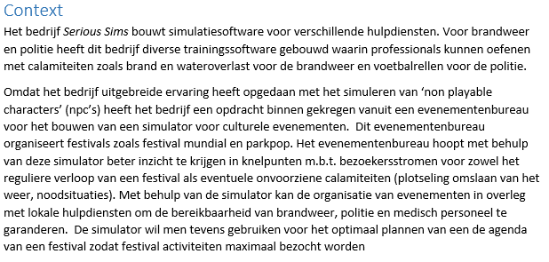
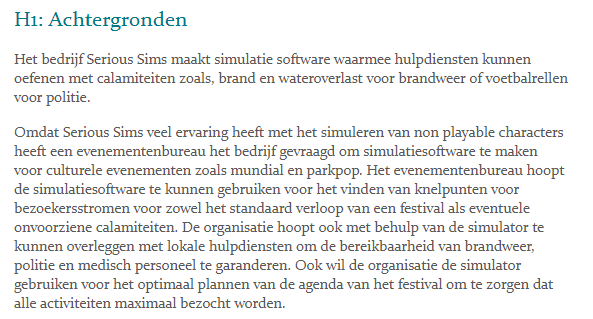
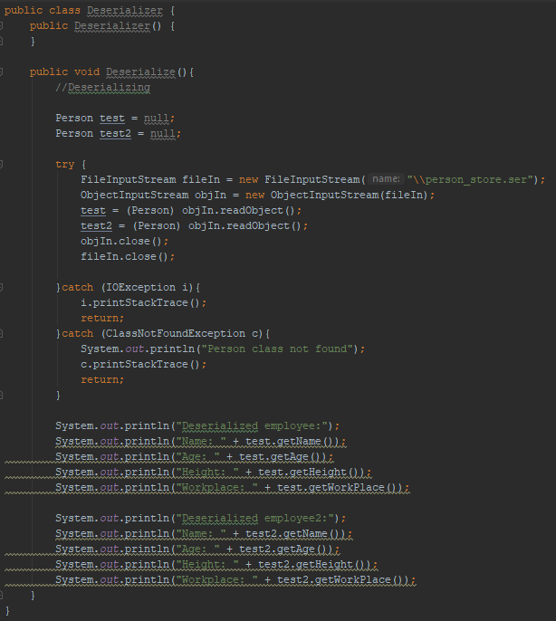
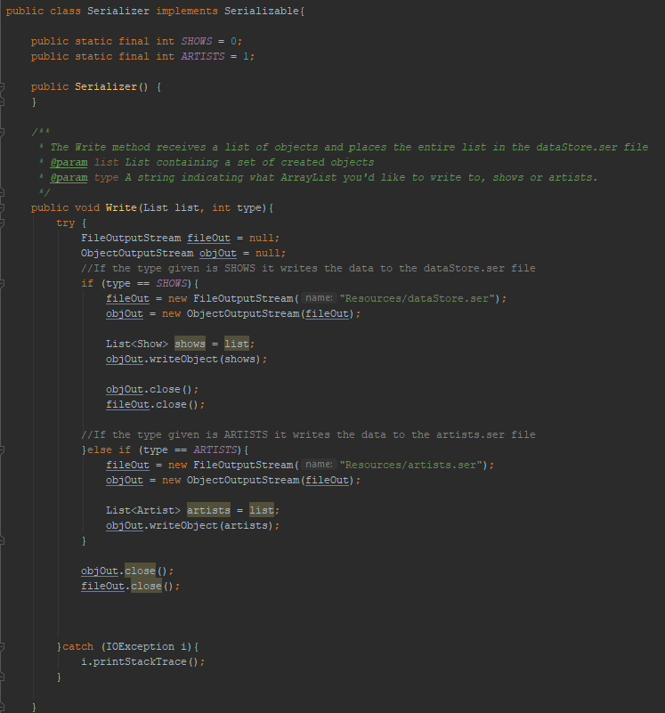
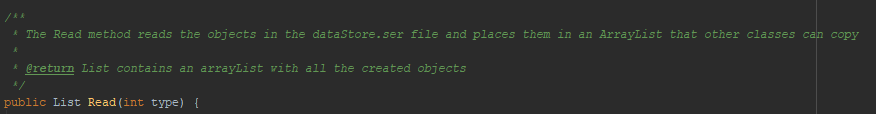
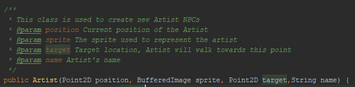

#Portfolio
###Florian Jäger
#####Studentnummer: 2116120
#####Klas: 1B

#Wekelijkse Reflecties

##Week 1:
In deze week zijn we nog niet begonnen met Java code. We hebben vooral gewerkt aan een plan van aanpak. Dit was onderverdeeld in aparte kopjes,
zelf heb ik de achtergronden uitgewerkt. Dit was een relatief kort kopje, dus ik heb niet veel gedaan in deze week, terwijl anderen in het 
groepje veel grotere stukken hebben moeten schrijven. In andere woorden: deze week was het werk niet compleet "eerlijk" verdeeld.

## Week 2:
Aan het begin van de week is een klassendiagram vastgesteld waar de basis van de klassen die we verwachten nodig te hebben voor de 
agenda module staan omschreven. Ik heb de Show klasse gemaakt, maar net als in week 1 heb ik een hele korte klasse met weinig inhoud, 
en dus ook weinig tijd en moeite. Andere mensen in het groepje hadden weer wat meer werk, en hoewel het niet veel beter ingedeeld had 
kunnen worden is het toch vervelend om te kunnen zien dat je groepsgenoten veel meer werk aan het doen zijn dan jij.

##Week 3:
In deze week heb ik zelf al een stuk meer gedaan. Deze week heb ik gewerkt aan ObjectIO, oftewel het opslaan van onze gegevens in een bestand.
Aan het begin van de week ging het lastiger, maar in het weekend is veel vooruitgang gemaakt en heb ik dus voor de deadline een grotendeels
functioneel stuk code kunnen opleveren. Er waren nog wat fouten en imperfecties waardoor de code niet helemaal goed werkte, maar dit is 
door de loop van de maandag in week 4 nog opgelost.

##Week 4:
Deze week is begonnen met het verbeteren van de ObjectIO code. Dit heeft niet al te lang geduurd en daarna was er een compleet functioneel 
stuk code. Ook zijn we deze week begonnen met het inladen van een festival.map_old voor de simulatie. Aangezien dit alle taken waren voor deze week,
heb ik zelf niet veel gedaan in de rest van de week.

##Week 5:
De opzet van de simulatie is in deze week gemaakt. Op maandag hebben we eerst samen wat definitieve keuzes gemaakt over hoe het eruit 
komt te zien en wie wat moet doen. Daarna ben ik begonnen met het maken van de NPC klasse. Voor een groot deel van de week heb ik dit
uitgesteld. Voor een gedeelte omdat ik er vanuit ging dat het een simpel programma was om te maken, maar ook omdat ik niet alle dagen
tijd had om eraan te werken. In het weekend is het werkend gemaakt, met wat kleine verbeteringen en bufxixes aan het begin van week 6.

##Week 6:
In deze week heb ik geen tijd gehad om veel met de groep samen te zitten, maar ik heb op maandag verder gewerkt aan het verbeteren van de
NPC klasse. Later in de week heb ik wat verbeteringen gemaakt aan de Artist klasse voor de agenda module. Dit is niet een hoge prioriteit
in deze fase van het project, maar wel iets wat we als groep nog graag verbeterd willen hebben. Aangezien de enige grote taak voor deze 
week de pathfinding was en hier al twee mensen aan werkten, hadden we als groep besloten dat de mensen die minder te doen hadden terug 
naar de agendamodule kunnen gaan. Zelfs al had ik dingen te verbeteren in de agenda module heb ik er niet veel aan gedaan. Ik heb deze week 
besloten meer te werken aan individuele school taken waardoor de proftaak voor mij persoonlijk een lagere prioriteit was.

##Week 7:
Deze week zijn veel verbeteringen gemaakt. Om te beginnen heb ik samen met Remco gewerkt aan de agenda module. Dit hield in dat we extra features
toe voegden om te zorgen dat we alle functionaliteit hebben wie we in de simulatie module willen, maar ook dat meer restricties hebben 
toegevoegd voor dingen die de gebruiker niet mag doen. Verder zijn er algemene bugfixes toegepast en is gewerkt aan de algemene stabiliteit.
Ook is gewerkt aan het verbetering en uitbreiden van de pathfinding. Vooral Dogukan en Kim hebben hieraan gewerkt. Richting het einde van 
de week gingen we meer over naar wat maintenance voor het programma, wat in dit geval betekende dat we de code gingen opschonen en commentaar 
hebben toegevoegd voor alle klassen. Dit maakt het niet alleen makkelijker voor ons om te kunnen werken aan code die is geschreven door 
andere groepsleden, maar ook om snel problemen te vinden in de code en te identificeren welke code problemen veroorzaakt.
Deze week was niet heel veel te doen voor mij persoonlijk. Remco heeft een groot deel van de code voor de aanpassing aan de agenda module
geschreven met af en toe wat hulp van mij, en mijn code had grotendeels al commentaar dus dat kostte ook niet veel tijd. Ondertussen 
hebben we in de groep ook al wel geaccepteerd dat niet iedereen altijd bezig kan zijn met de code. Hoewel ik dat niet heel prettig vind is
het de realiteit van het project en kan er momenteel niet veel aan gedaan worden, dus ik moet andere taken vinden om mezelf nuttig 
te maken. 

##Week 8:
In deze week begon het moeilijk te worden om goed samen te werken in verband met de COVID-19 maatregelen. Tot nu toe hebben we de meeste 
minstens één of twee maal per week samen gezeten om aan het project te werken, wat nu dus via Discord moet gebeuren. Het is natuurlijk
niet ideaal, maar het aanpassen hieraan gaat relatief goed. De grote taak voor deze week bestond uit drie dingen: NPC's op de map 
weergeven, NPC's laten rondlopen volgens de pathfinding en de simulatie laten afspelen volgens data uit de agenda module. Elke van deze 
taken hebben we op een aparte dag uitgevoerd. Hoewel ik persoonlijk niet geheel tevreden ben met de code is het wel allemaal functioneel. 
De code is niet heel efficiënt en gebruikt eigenlijk te veel if-statements naar mijn mening, maar met de beperkte tijd die we hebben is 
het belangrijker om het eerst functioneel te maken. Zelfs met de moeilijkere samenwerking hebben we wel met zijn alle aan de code kunnen 
werken en was het ook wel sneller klaar dan wanneer één iemand er alleen aan had gezeten. Ik vraag me wel af hoe dit gaat werken als we
de volgende periode in gaan met een nieuwe projectgroep, daar kijk ik zelf een beetje tegenop als het zo door gaat.

##Week 9:
In deze week is niet heel veel gedaan. Eerst zijn wat algemene functies toegevoegd aan de simulatie, dingen zoals het kiezen van shows 
om naartoe te gaan gebaseerd op populariteit, NPC's die weg gaan aan het einde van de show en NPC's die naar "neutrale" zones gaan als 
ze niks doen. Ook heeft Timo gewerkt aan het implementeren van een manier om de tijd handmatig aan te passen. Hij heeft een manier 
geïmplementeerd om de snelheid van de tijd te veranderen en om de tijd vooruit en achteruit te spoelen. Met wat kleine aanpassingen heb 
ik ervoor gezorgd dat de NPC's de verandering van tijd ook goed verwerken, waarna alle geplande functies geïmplementeerd zijn in het 
programma. Ik denk dat de groep in het algemeen wel blij is dat de functies allemaal geïmplementeerd zijn, en ik moet zeggen dat ik ook 
wel een beetje trots ben op het af hebben van het project, zelfs als ik er nog niet helemaal tevreden mee ben. 

#Vakinhoudelijke reflectie

##Week 1:
In deze week was inhoudelijk nog niet veel te doen. Voor het stukje achtergronden moest ik wel redelijk veel zoeken naar informatie over 
het fictieve bedrijf dat ons heeft ingehuurd, de enige informatie die we hebben gehad is namelijk een bestand met een kort stukje tekst
waarin staat dat we ingehuurd zijn door een festival planner. Er is geen naam of iets dergelijks verder genoemd, dus toen moest ik kiezen of
ik het bedrijf zonder naam in het stukje tekst zet of ik een naam verzin. Ik heb besloten het geleverde bestand zo nauwkeurig mogelijk 
aan te houden en dus geen naam voor het bedrijf te noemen. Hoewel dit ervoor zorgt dat het kopje mager is en inhoudelijk redelijk saai, 
het is wel een betere representatie van de opdracht die we hebben. 

Hieronder eerst een foto van de bijgeleverde context over de proftaak, met daarna het stuk wat ik hierover heb geschreven.

##Week 2: 
In de wekelijkse reflectie is alles over deze week eigenlijk al uitgelegd: weinig werk om te doen en het beetje werk wat er wel was, was erg
simpel buiten één taak die is gegaan naar twee andere groepsleden. Dit betekent ook dat er geen keuzes zijn gemaakt door mij en dat er geen
interessante code is om hierin te laten zien. 

##Week 3:
Aan het begin van deze week had ik absoluut geen idee over wat ObjectIO inhoudt of hoe het gebruikt moet worden. Het enige wat ik wist 
is dat ik data heb en dat die naar een bestand geschreven moet worden. Na een paar uur onderzoek heb ik uitgevonden hoe het moet en heb 
ik twee klassen geschreven die data naar een bestand kunnen schrijven of uit een bestand kunnen uitlezen. Deze klassen worden hieronder afgebeeld.
Het implementeren van de klassen was het moeilijkere deel. Ik heb uiteindelijk besloten alle objecten die opgeslagen moeten worden in
een enkele `List<>` op te slaan en dan deze `List<>` op te slaan in het bestand, op deze manier hoef ik dan maar 1 object op te slaan of uit
te lezen. Ik weet niet of dit de meest efficiënte manier is om data op te slaan, maar aangezien we met een kleine hoeveelheid informatie werken
is efficiëntie momenteel niet de grootste zorg voor mij.
 
 
 
 
 ##Week 4:
 Persoonlijk heb ik deze week vooral gewerkt aan het verbeteren van de ObjectIO code. Dit houdt in dat ik wat problemen heb opgelost en
 heb gezorgd dat de data ook goed in het programma werd opgenomen. Het grootste probleem wat in de code zat was dat er een error werd opgegeven 
 als een leeg bestand wordt uitgelezen. De meest robuuste manier om dit op te lossen leek mij door te zorgen dat als deze error optreed een 
 methode wordt aangeroepen die een lege `List<>` in het bestand plaatst. Dit is gedaan door de volgende code:
 
     public void Clear(){
         try {
             FileOutputStream fileOut = null;
             ObjectOutputStream objOut = null;
 
             fileOut = new FileOutputStream("Resources/dataStore.ser");
             objOut = new ObjectOutputStream(fileOut);
 
             objOut.writeObject(new ArrayList<Show>());
 
 
             fileOut = new FileOutputStream("Resources/artists.ser");
             objOut = new ObjectOutputStream(fileOut);
 
             objOut.writeObject(new ArrayList<Artist>());
 
             fileOut = new FileOutputStream("Resources/stageStore.ser");
             objOut = new ObjectOutputStream(fileOut);
 
             objOut.writeObject(new ArrayList<Stage>());
 
             objOut.close();
             fileOut.close();
 
         }catch (IOException i){
             i.printStackTrace();
         }
     }
 
Dit stuk code overschrijft wat in de bestanden staat met een lege `List<>`, wat betekent dat dit ook meteen hergebruikt kan worden als 
een manier om alle date te verwijderen, dus op deze manier heb ik een stuk code die in de meeste gevallen die error moet oplossen en 
meteen als feature kan worden hergebruikt. 

##Week 5:
Het maken van het begin van de NPC klasse was niet moeilijk. Het begon met een Abstract klasse NPC die wat simpele variabelen zoals positie,
draaihoek, snelheid en sprite had. Daarna heb ik besloten een aparte subklasse te maken voor Visitor en Artist. Ik heb gekozen dit te doen 
omdat de Visitors en Artists allebei naar andere locaties zouden moeten gaan en op andere plekken toegestaan zijn om te lopen, dus het leek
me het makkelijkste om er aparte klassen van te maken, vooral als ze nog complexer zouden worden. Momenteel is het grootste verschil tussen
de Visitor en Artist klassen dat de Artist klasse een `String name` variabele heeft om te zorgen dat alle artiesten naar hun eigen stage gaan, 
terwijl de Visitors geen namen hebben. 

##Week 6:
In deze week heb ik weinig aan de proftaak gewerkt omdat ik dingen had waardoor ik niet aanwezig kon zijn op school. Ik heb alleen 
wat kleine stukjes code verbeterd en opgeschoont.

##Week 7:
Ook deze week is er weinig wat ik persoonlijk heb gemaakt. In de bijgevoegde afbeeldingen zijn wat voorbeelden te zien van de manier waarop
wij als groep hebben besloten commentaar te schrijven. Deze manier van commentaar schrijven zorgt ervoor dat er een standaard format is
waar iedereen zich makkelijk aan kan houden, maar ook dat er automatisch een Javadoc gegenereerd kan worden. Voor kleinere stukjes code 
in het midden van een methode of klasse die wat extra duidelijkheid nodig heeft gebruiken we gewoon wat simpele regels commentaar die er 
zo uit zien: `//Additional info about code`. Dit heeft geen standaard format verder en wordt alleen gebruikt als iemand een stuk code schrijft
waarvan ze denken dat wat extra uitleg geen kwaad kan.

##Week 8:
Deze week zijn drie verschillende features geïmplementeerd. De eerste was NPC's op de map laten lopen. Om dit werkend te krijgen hebben we 
grotendeels code van een demo die in een les was gegeven gekopiëerd en omgeschreven om beter te werken voor ons. Het grootste deel van deze 
feature gebeurt in de init methode, waaron met de volgende code alle NPC's worden aangemaakt zodat ze in de draw methode getekend kunnen worden:  

         while (this.visitors.size() < 20) {
             Point2D spawnPoint = new Point2D.Double(Math.random() * 320 + (50 * 32), Math.random() * 320 + 40 * 32);
             Visitor visitor = new Visitor(spawnPoint, imageVisitor, this.toiletVisitor);
             boolean spaceTaken = false;
             if (this.visitors.isEmpty()) {
                 visitor.setRoute(this.route3);
                 this.people.add(visitor);
                 this.visitors.add(visitor);
             } else if (!this.people.isEmpty()) {
                 for (NPC npc : this.people) {
                     if (npc.getPosition().distance(spawnPoint) <= NPC.SPRITESIZE) {
                         spaceTaken = true;
                     }
                 }
                 if (!spaceTaken) {
                     visitor.setRoute(this.route3);
                     this.people.add(visitor);
                     this.visitors.add(visitor);
                 }
             }
         }
 Dit is het stuk code dat een groep visitors aanmaakt, de artists hebben een soortgelijk stuk code.
 
 De volgende feature die geïmplementeerd moest worden was het toepassen van pathfinding aan de NPC's. Dit was niet makkelijk, omdat er niet
 genoeg communicatie was tussen mij en de mensen die de pathfinding hadden gemaakt. Dit zorgde ervoor dat we allebei onze eigen ideeën hadden over
 hoe we de NPC's moesten laten lopen maar deze ideeën niet aan elkaar hebben doorgegeven. In de praktijk betekende dit dat ik de NPC's had 
 gemaakt met een eindpunt in gedacht, terwijl mijn groepsgenoten de pathfinding hebben gemaakt met het idee dat de NPC's alleen hoeven 
 te weten naar welke tile ze hun volgende stap moeten zetten. We hebben veel moeten herschrijven om het werken te krijgen, maar uiteindelijk
 hebben we de NPC's kunnen omschrijven om met de pathfinding samen te werken. Hierbij moest dus wel een keuze gemaakt worden over welke klasse 
 we zouden omschrijven. We hebben besloten om de NPC's om te schrijven aangezien die een stuk minder ingewikkeld zijn. Het omschrijven was gedaan door
 de NPC's extra variabelen mee te geven, namelijk `Point2D endPoint`, `Point2D target` en `String route`. De `route` variabele wordt gebruikt 
 zodat de pathfinding klasse weet welk pad gevolgd moet worden. `endPoint` houdt bij wat het uiteindelijke doel van de NPC is terwijl `target` bij houdt
 naar welke tile de NPC als volgende wil bewegen. Door het op deze manier te doen kunnen we nog steeds bij houden wanneer de NPC op zijn einddoel 
 is door zijn `position` te vergelijken met zijn `endPoint` terwijl de bewegingsrichting bestuurd kunnen worden door de `target` aan te passen 
 met de informatie die de pathfinding klasse geeft gebaseerd op de informatie in `route`.
 
 De laatste feature deze week was het koppelen van de agenda module met de simulatie module. Door de manier waarop we de agenda module hebben
 gemaakt was dit relatief simpel. Het enige wat we moesten doen was wat hardcoded waardes vervangen met calls naar de `DataStore` klasse.
 
 ##Week 9: 
 De grootste feature die ik deze week heb geïmplementeerd was het meerekenen van de populariteit van een show als een Visitor besluit om naar 
 een show te gaan. Dit heb ik gedaan door middel van het volgende stukje code:
 
    if ((Math.random() * 100) <= (double)show.getPopularity()){
                             visitorAction = 1;
                         }
 
 Dit stuk code genereert een waarde tussen 1 en 100 en vergelijkt dit dan met de populariteit van de show. Als de gegenereerde waarde lager 
 is dan de populariteit gaat de Visitor naar de show (dat is wat het `visitorAction = 1` stuk doet), anders doet de Visitor niks.
 
 Ik had twee mogelijke manieren waarop ik dit had kunnen implementeren. De eerste was de populariteit gebruiken als een waarde die weergeeft hoe 
 veel mensen naar de show moeten. Dit zou makkelijker te implementeren zijn, maar zou ook betekenen dat het alleen werkt als er een bepaalde
 hoeveelheid Visitors worden weergegeven op de map. De manier die ik nu heb gebruikt werkt met percentages, wat betekent dat het werkt 
 ongeacht hoeveel Visitors er momenteel worden gesimuleerd en is om deze reden volgens mij ook robuustere code.
 
 #Reflectie op stelling
 
Ik ga reflecteren op de stelling "in het bedrijfsleven wordt steeds meer in software gesimuleerd".

Om te beginnen kan ik hier al wat over zeggen uit persoonlijke ervaring. Ik ben op bezoek geweest bij of heb gewerkt voor bedrijven waarvan
je niet zou verwachten dat software simulaties nodig zijn die toch steeds meer gaan simuleren, voornamelijk zodat ze meer zekerheid hebben
als ze planningen maken of als ze aanpassingen maken aan hun productielijnen.

Om meer gedetailleerde informatie te kunnen geven ben ik begonnen met het opzoeken van wat algemene informatie, waardoor ik te weten ben gekomen
dat een veelgebruikte vorm van simulatie bij bedrijven bestaat uit het bekijken van oudere gegevens, zoals invoer / uitvoer verhoudingen, 
kosten per geproduceerd onderdeel, hoeveelheid geproduceerde producten per uur en natuurlijk winsten en verliezen. Vervolgens worden deze verhoudingen 
en formules ingevoerd in een simulatie en worden nummers aangepast, bijvoorbeeld om te kijken wat er zou gebeuren als een nieuwe productie
machine wordt toegevoegd. Voordat zoiets gedaan wordt wil de eigenaar van het bedrijf natuurlijk eerst weten of de verhoging van winst wel groot
genoeg is om de aanschaf kosten van de machine te kunnen veroorloven. 

Een andere vorm van simulatie in de bedrijfswereld lijkt meer op bedrijf simulatie games. Dit zijn stukken software die een heel bedrijf
simuleren, waarin een manager vervolgens kan experimenteren met het invoeren van andere werktijden, inhuren of ontslaan van personeel en andere 
soortgelijke zaken. Als een manager eerst de kans krijgt om zulke situaties te simuleren hoeft de manager minder risico's te nemen om zijn 
bedrijf beter te laten lopen. Hoewel ik wist dat simulaties gebruikt werden voor zulke zaken, was ik me er niet van bewust dat in bedrijven
ook simulaties worden gebruikt die meer functioneren als traditionele games in plaats van stukken software die eruit zien als een Excel
spreadsheet. 
Op de website van de [ABSEL](https://absel.org/?page_id=35) is een lijst van games te vinden die gebruikt worden om mensen te laten
experimenteren met management styles of om ze beter voor te bereiden als ze een manager positie bij een nieuw bedrijf aangewezen krijgen.

#####Conclusie
 Hoewel ik al wist dat in het bedrijfsleven simulaties werden gebruikt om een beter beeld te krijgen van het bedrijf in het algemeen en
 om risico's te verminderen, was ik me er niet van bewust dat er ook een markt is voor simulatie games. Deze games kunnen gebruikt worden 
 om nieuwe managers wat extra ervaring te geven in een veilige omgeving, of om ervaren managers een ruimte te geven waarin zij hun ideeën 
 kunnen testen zonder de werking van het bedrijf in gevaar te brengen.
 
 #JSON applicaties
 
 ##Game modding
 Dit is waar ik persoonlijk het meeste JSON bestanden gebruik. Voor het spel Blade and Sorcery worden voor alle items in het spel JSON 
 bestanden gemaakt met informatie over het wapen. Omdat JSON's de informatie in een simpele en leesbare manier weergeven is het heel 
 makkelijk om met deze datastructuur aspecten van bestaande items aan te passen naar je eigen wensen of om je eigen items in de game te 
 modden door simpeleweg wat nieuwe JSON bestanden toe te voegen. Natuurlijk zijn er eisen waar je aan moet voldoen om het werken te maken, 
 maar de simpele structuur van de bestanden maakt het veel simpeler dan het moeten programmeren van de items en maakt het troubleshooten en
 fine-tunen veel sneller en makkelijker.
 
 ##Websites
 Websites worden vaak gebouwd door middel van HTML. JavaScript, waar JSON ook een onderdeel van is, kan makkelijk omgezet worden naar HTML code,
 wat betekent dat het heel makkelijk is om een JSON te gebruiken om je instellingen op te slaan zodat het makkelijk is om snel terug te 
 kijken of aanpassingen te maken aan de code.
 
 ##Javascript applicaties
 Dit is minder specifiek, maar aangezien JSON een onderdeel is van Javascript worden bij een groot deel van de applicaties die worden 
 gemaakt in Javascript JSON bestanden gebruikt voor het opslaan en uitwisselen van informatie. 