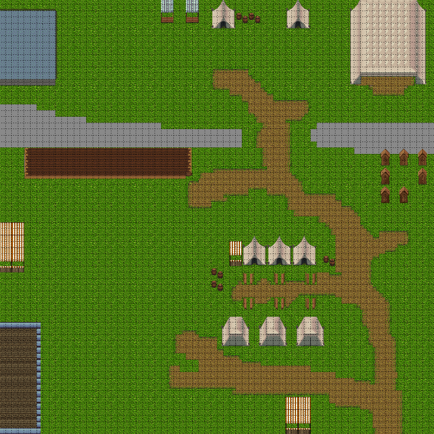
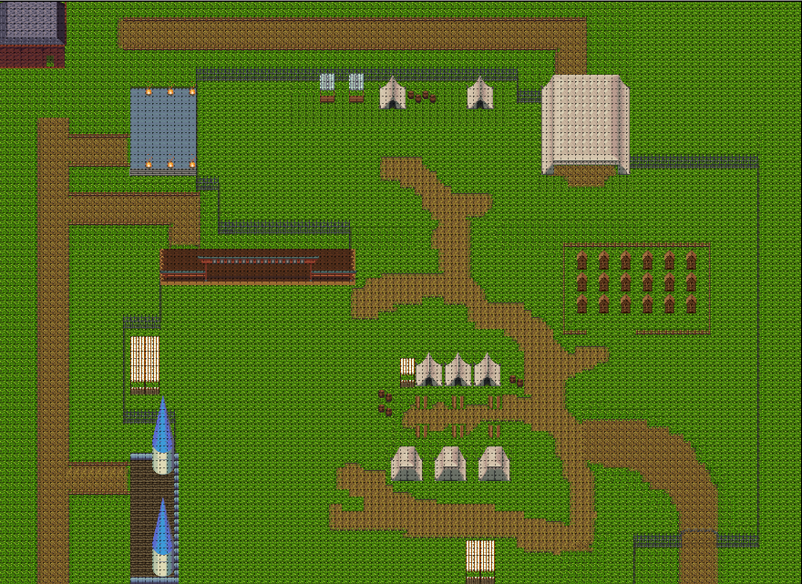

# Portfolio
### Nathalie Seen
##### Studentnummer: 2135114
##### Klas: B
#### Jaar: 1

# Wekelijkse Reflecties

## Week 2
### proces:
Deze week hebben we het ontwerp van de GUI gemaakt en zijn begonnen aan het implementeren van de GUI.
We hebben samen gekeken welke klasse we willen impementeren.
Toen we alle klassen hadden, hebben we hiervoor een klassediagram gemaakt. 
De verschillende klassen werden verdeeld, ik ging de podium klasse maken.
De podium klasse was niet moeilijk, ik was al snel klaar.
Ik ben daarom begonnen aan een schets voor het ontwerp van de GUI,
die ik op basis van wat we al van het ontwerp besproken hadden ging maken,
met daarnaast nog wat eigen bepaalde functionaliteiten.

### vakinhoudelijk:
De podium klasse was snel af, en het was een erg linear proces.
Voor de GUI waren er nog veel losse eindes. 
We hadden met elkaar vorige week en deze week de globale ontwerp van de GUI besproken.
Deze week heb ik een ontwerp getekent op basis van de besproken globale ontwerp.
De GUI moest nog andere functionaliteiten hebben naast wat wij besproken hadden.
Ik had hiervoor veel keuzes, bijvoorbeeld om een foutmelding toe te voegen.
Voor het ontwerp dacht ik hierbij aan een pop-up scherm. 
Dit was handig omdat de foutmelding dan erg duidelijk te weergeven is.
Daarnaast heb ik bij het ontwerp een extra pop-up scherm gemaakt zodat je nog een bevestiging hebt als je alles wilt verwijderen.
Dit is namelijk erg gebruikersvriendelijk, en niet al te moeilijk om te implimenteren.
uiteindelijk ziet het ontwerp er zo uit:


## Week 3
### proces:
Deze week was nog voornamelijk in het teken van de GUI,
maar vanwegen de verdeling was er voor mij en Timo niet iets te doen voor de GUI.
Timo en ik zijn deze week dus begonnen aan het maken van de tilemap in Tiled.
Het maken van de tilemap was erg simpel, alleen het zoeken van de juiste tileset was wat lastiger.
Naast het maken van de map, hadden wij ook als taak om de PVA uit te bereiden voor P&OC.
Hierbij heb ik de hoofdstukken kwaliteitsbewaking en projectgrenzen gemaakt.

### vakinhoudelijk:
Deze week heb ik dus voornamelijk met Timo aan de tilemap gewerkt.
We hadden alle vrijheid en konden de tilemap eruit laten zien zoals wij dat willen.
Wel hadden we een begrenzing met de tilesets, het was lastig om één goede uit te kiezen.
We hebben er daarom samen voor gekozen om 3 tilesets te gebruiken.
Dit is omdat alle 3 de tilesets wel iets hadden wat we nodig vonden en de andere tilesets dan niet hebben.
Nadat we de tilesets hadden moesten we de grootte bepalen, we hadden gekozen voor 50 bij 50.
Dit was voor ons allebij groot genoeg.
De podia hebben we zo geplaatst zodat het nog wel realistisch is, en er goed uit ziet.
uiteindelijk zag de map er zo uit:


## Week 4
### proces:
Deze week werd er gewerkt aan het uitlezen van de tilemap met json.
Dit was een lastige opgaven.
Zeker in het begin van deze week was het een erg langzaam begin.
Het onderzoeken duurde erg lang, 
dus het duurde wel even voordat we wisten wat we moesten doen om met json de tilemap uit te lezen.
Na ongeveer een goede dag onderzoke, was json een heel stuk duidelijker.
Nadat Timo een begin had gemaakt, ging ik verder werken.
Hierbij had ik ervoor gezorgd dat er meerdere layers en meerdere tilesets uitgelezen konden worden.
Waardoor we aan het eind van de week de tilemap fatsoenlijk uit hebben kunnen lezen met json.

### vakinhoudelijk:
Timo heeft een heel goed begin gemaakt, 
alsnog was het best lastig om dit om te zetten voor meerdere layers en tilesets.
Om meerdere layers en tilesets uit te lezen met json, moest ik de code van timo wel wat veranderen.
ik heb hierbij gekozen voor een compacte code met meerdere methodes.
Dit maakt de code overzichtelijker.
Hierdoor is het mogelijk om meer layers en tilesets makkelijker toe te voegen.
een voorbeeld van een methode die ik heb gemaakt is de drawLayers methode: 
```` java
private void drawLayers(Graphics2D g2d, int[][] map) {
        for(int y = 0; y < height; y++)
        {
            for(int x = 0; x < width; x++)
            {
                if(map[y][x] <= 0)
                    continue;
                //draw tile from tiles, at height y and width x
                g2d.drawImage(
                        tiles.get((map[y][x])-1),
                        AffineTransform.getTranslateInstance(x*tileWidth, y*tileHeight),
                        null);

            }
        }
    }
````

## Week 5
### proces:
Deze week hebben we ons nog verdiept in de tilemap.
Door deze in te laden zagen we namelijk dat de tilemap toch te klein was.
Hij paste daarnaast niet mooi in het venster.
Timo en ik zijn dus weer gaan zitten en hebben de tilemap verder uitgebreid met een artiesten zone.
Daarnaast ben ik deze week begonnen om een camera klasse te maken en goed te laten functioneren.
Helaas is dit mij deze week niet gelukt.

### vakinhoudelijk:
We moesten de tilemap deze week uitbereiden.
We wilden alseerst weten hoe groot we het dan moesten maken.
Uiteindelijk hebben we gekozen voor 110 bij 80, 
hierdoor past de tilemap beter in het venster, en is de tilemap niet te groot.
We moesten ook nog kijken wat we erbij toe wilde voegen.
Dit was uiteindelijk een artiesten zone geworden.
We hebben dat gekozen omdat het realistisch is dat de artiesten een eigen zone hebben en niet langs de bezoekers hoeven te lopen.
Daarnaast was het makkelijk om deze nog aan de zijkant erbij te doen.
Dit is het eindresultaat:

## Week 6
### proces:
In deze week hebben we de collision en object layers besproken.
We zijn met z'n vieren gaan zitten en hebben gekeken waar we de collision op de map willen.
Daarnaast hebben we naar de targets van de NPC's gekeken en deze toegevoegd bij de objectlayer.
Ik heb zelf ook verder gewerkt aan de camera klasse.
Deze week lukte het me beter, en met wat hulp van mijn groepsleden is het gelukt om de camera klasse werkend te krijgen.
Er is nu wel wat lag, maar de camera werkt, en we zijn van plan om de lag komende week te verminderen.
Deze week hadden we ons al verdiept om te kijken of de tilemap één afbeelding kan worden.
Dit is nog niet gelukt.

### vakinhoudelijk:
Voor de camera klasse waren er niet veel keuzes die ik anders kon maken.
Bij de object layer hebben we wel wat moeten overleggen.
We hadden namelijk de keuze voor de grootte van elke target voor en op het podium.
Uiteindelijk, hebben we voor elk podium een zo groot mogelijk vierkant als target gezet, 
zonder de andere podia of andere events te storen.
Hiedoor hebben de bezoekers genoeg ruimte om te lopen, en zullen ze andere optredens niet storen.

## Week 7
### proces:
Deze week was een lastige week, we konden niet meer fysiek afspreken met elkaar, of met de leraren.
Deze week ging alle comunicatie met de groep via discord.
Ondanks dat alles ben ik deze week voornamelijk bezig geweest met een limiet stellen voor de camera.
Het leek erg makkelijk, maar ik had het onderschat omdat de afbeelding na het limiet steeds versprong.
Ik heb er uiteindelijk nog best lang aan gezeten.
Daarnaast had ik deze week mijn deel van het PVA verbeterd.

### vakinhoudelijk:
De camera werkte, maar voor een goed beeld is het het beste om een limiet te stellen aan de zoom.
Ik heb dit deze week proberen te doen. 
Maar de tilemap versprong toch altijd na het limiet.
Ik kon ervoor kiezen om er niks aan te doen, maar ik kon ook kijken voor een betere limiet op het scherm.
Daarnaast had ik er ook voor kunnen kiezen om een limiet op het scrollen van de muis te zetten
Ik heb uiteindelijk gekozen om dit tegen te gaan door ook een limiet te zetten op het scrollen van de muis.
Uiteindelijk ziet het stukje code er zo uit:
```` java
public void mouseScroll(ScrollEvent e) {
		this.resizable.draw(this.graphics);
		if (this.zoom < 0.16){
			if(e.getDeltaY() > 0){
				this.zoom = 0.16;
			}

		} else if (this.zoom > 2){
			if(e.getDeltaY() < 0) {
				this.zoom = 2;
			}

		} else {
			this.zoom *= (1 + e.getDeltaY() / 250.0f);
		}


	}
````
	


## Week 8
### proces:
Deze week was voornamelijk samen op discord.
We hebben gezamelijk de NPC's op de map laten lopen.
Daarna hebben we ervoor gezorgd dat ze de pathfinding die Kim en Dogukan hebben gemaakt volgt.
Als laatst hebben we deze week samen de simulatie verbonden met de data store,
en de NPC's onderverdeeld in artists en bezoekers.
Ik heb deze week daarnaast ook de afbeeldingen voor de NPC's gemaakt.

### vakinhoudelijk:
Aangezien het deze week allemaal gezamelijk was, waren er niet veel keuzes die ik kon maken voor de NPC code.
Wel heb ik de poppetjes zelf gemaakt, hierbij heb ik wel een keuze gemaakt.
Ik kon namelijk kiezen of ik iets van het internet zal halen, of zelf zal maken.
Ik zocht op het internet, maar kon niks vinden, dus had zelf de NPC poppetjes gemaakt.
Hierbij probeerde ik op de kleuren te letten. 
Ik heb de bezoekers een blauwe trui gegeven omdat deze voornamelijk op het groene gras zullen lopen.
Ik heb de artist juist een groene trui gegeven omdat ze voornamelijk op de podia staan.\
dit is de artist:
\
dit is de bezoeker:


## Week 9
### proces:
Deze week was weer alleen comunicatie met discord.
We hadden alles al bijna af en hadden begin van de week de taken verdeeld.
Ik heb hierbij gekozen om de presentatie te maken.
Daarnaast hebben we afgelopen dagen nog samen de laatste dingen verbeterd.

### vakinhoudelijk:
Ik heb deze week alleen de presentatie in mijn eentje gedaan.
We hadden minder informatie van wat er in de presentatie moest staan dan normaal.
Ik had daarom een ruime keuze voor welke hoofdstukken ik erin zou willen hebben.
Ik heb uiteindelijk gekozen om het te verdelen in de fases.
Alseerst de projectaanpak, daarna de planning.
Voor de demonstratie komt nog de ontwerpkeuzes van de GUI en de simulatie.
ALs laatst hebben we de evaluatie.

# Stelling
**In het bedrijfsleven wordt gebruik gemaakt van JavaFX**

In veel bedrijven die java gebruiken wordt er nog gebruik gemaakt van java swing. 
Veel van deze bedrijven weten niet hoeveel beter javafx is.
Daarnaast kan het voor andere bedrijven te duur zijn om al hun aplicaties van java swing naar javafx te veranderen.
Gelukkig zijn er toch wel wat bedrijven die wel javafx gebruiken, en er ook veel profijt van hebben.
javafx is niet alleen beter dan java swing, maar sommige dingen lukken wel met javafx, die totaal niet gaan met java swing.
Tegenwoordig komen meer bedrijven bij dit probleem. 
Deze bedrijven stappen dan ook over na javafx.
[javafx vs java swing](https://www.educba.com/javafx-vs-swing/)

Javafx wordt gebruikt voor desktop applicaties en games als je java als programeertaal gebruikt.
Java is één van de meest gebruikte programeertalen voor bedrijven,
veel bedrijven maken dus gebruik van java,
en voor desktop applicaties en games zal javafx dus voornamelijk gebruikt worden.
[top programeer talen](https://www.techrepublic.com/article/the-10-most-in-demand-programming-languages-for-developers-at-top-companies/)

Ik weet dat java swing een voorganger is van javafx. Ik heb hierdoor gekeken naar javafx vs java swing,
om te kijken welke beter is en welke er momenteel meer wordt gebruikt. 
Daarna ging ik kijken hoeveel bedrijven java als programmeertaal gebruiken. 
Als dit er niet veel zijn, zou javafx en java swing allebij niet vaak worden gebruikt.

Concluderend, java wordt door veel bedrijven gebruikt, hierdoor worden javafx en java swing dus ook vaak gebrukt voor desktop applicaties.
Maar voor veel bedrijven zal het te duur zijn, of te veel moiete kosten om van java swing naar javafx te gaan. 
Hierdoor zullen er alsnog best veel bedrijven zijn die java als programmeertaal gebruiken,
maar toch java swing gebruiken, ondanks dat javafx beter is.

# JSON
JSON staat voor javaScript Object Notation en het kan voor elke programeertaal gebruikt worden.
JSON maakt gebruik van alleen tekst en is een lightweight format.
JSON zorgt voor het sorteren en transporteren van data, en wordt vaak gebruikt als er data van een server naar een webpagina moet.
Hierdoor denk ik dat bijvoorbeeld facebook goed gebruik kan maken van JSON, 
door de data die ze van de mensen verzamelen op te slaan op de server en met JSON weer laden bij de webpagina voor bijvoorbeeld het inloggen.\
Ik denk ook dat het handig is voor smartwatches. De data die de smartwatch ontvangt van bijvoorbeel je hartslag en stappen,
kunnen makkelijk opgeslagen worden via JSON, en weer op een website, of een app worden ingeladen.\
Als laatst denk ik dat JSON ook goed is voor Web games.
De webgames moeten de vooruitgang van de game op kunnen slaan samen met de inloggegevens.
Ik verwacht dat dit handig zal zijn met het JSON formaat.